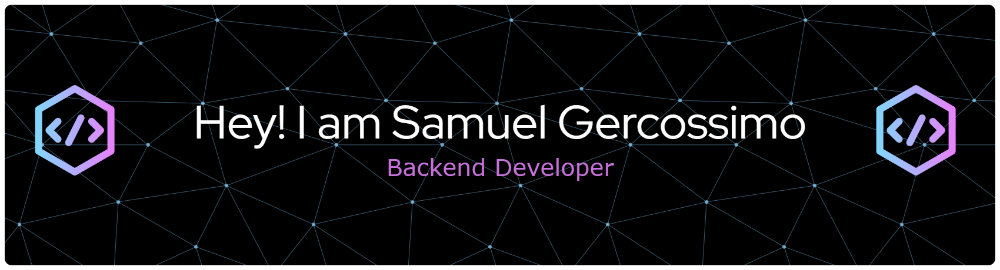

## 🚀 I'm a Java developer in the learning phase!
## 🚀 About me 

```java
public class SamuelGer {
    private String name = "Samuel Gerossimo";
    private String role = "Software Engineer";
    private String[] languages = {"pt_BR", "en_US"};
    private String status = "Always learning & coding (I love coding)";
    private String[] skills = {"Java", "SQL"};

    public void sayHello() {
        System.out.println("Hello there! Welcome to my coding space!");
        // From Brazilian coder
        System.out.println("Oiá, Bem-Vindo ao meu espaço favorito.");
    }

    public static void main(String[] args) {
        SamuelGer samuel = new SamuelGer();
        samuel.sayHello();
    }
}
