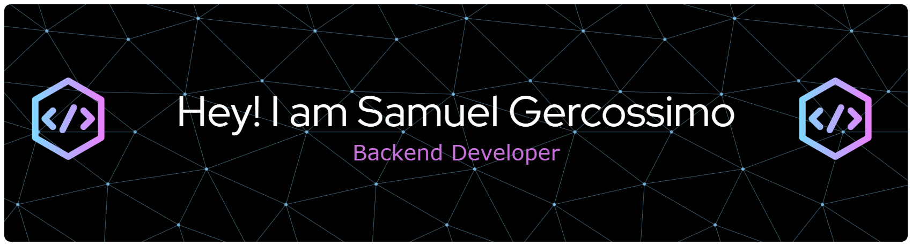

_**Student** at UNA University - Brazil_  
_**Analysis and Systems Development** - Belo Horizonte_
## 🚀 I'm a developer! <a href="https://www.java.com/" target="_blank"></a>  


### 🚀 About me 

```java
public class SamuelGer {
    private String name = "Samuel Gercossimo";
    private String[] roles = {"Software Engineer", "Backend Developer"};
    private String[] languages = {"pt_BR", "en_US"};
    private String status = "Always learning & coding (I love coding)";
    private String[] skills = {"Java", "SpringBoot", "SQL", "API's REST"};
    private String favoriteProgrammingLanguage = ".java"

    public void sayHello() {
        System.out.println("Hello there! Welcome to my portfolio!");
        // From Brazilian coder
        System.out.println("Bem-Vindo ao meu espaço favorito.");
    }

    public static void main(String[] args) {
        SamuelGer samuel = new SamuelGer();
        samuel.sayHello();
    }
}
```

### Connect with me  
<a href="https://linkedin.com/in/samuel-gerçossimo-3a4635368" target="_blank">

</a>
<a href="https://instagram.com/sferreiragc?igsh=MW16MWs5NmZiY25lOQ==" target="_blank">

</a>  
<br/>  
